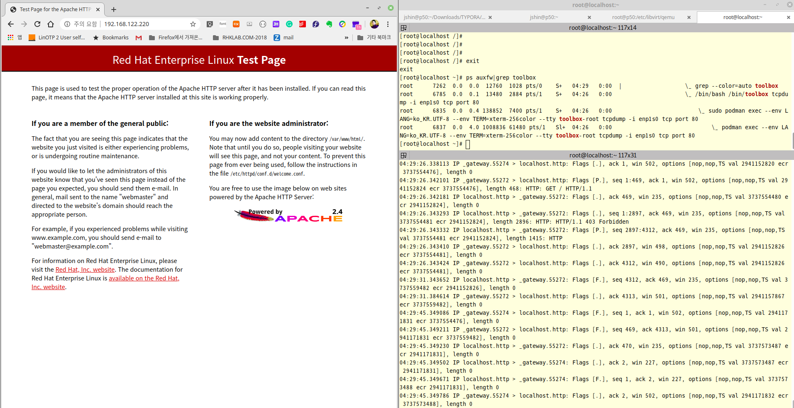

# RHCOS(Red Hat Enterprise Linux CoreOS) Debugging quick start with toolbox

​																																					Written by: [Junhee Shin](jshin@redhat.com)


## RHCOS Installation using RHOCS ISO Image
----


## Prerequisites


​      
* [RHCOS(Red Hat Enterprise Linux CoreOS) latest Download](https://mirror.openshift.com/pub/openshift-v4/x86_64/dependencies/rhcos/latest/latest/)

* Repository server setup for RHCOS Installation

~~~
    [root@p50 repos] # dnf install -y httpd     <--- Apache httpd Server Installation
    
    [root@p50 repos] # systemctl enable --now httpd     <-- httpd service enable and start
    Created symlink /etc/systemd/system/multi-user.target.wants/httpd.service → /usr/lib/systemd/system/httpd.service.
    
    [root@p50 ~] # systemctl status httpd   <-- httpd service status check
    ● httpd.service - The Apache HTTP Server
       Loaded: loaded (/usr/lib/systemd/system/httpd.service; enabled; vendor preset: disabled)
       Active: active (running) since Mon 2020-02-03 14:26:16 KST; 2 days ago
         Docs: man:httpd.service(8)
     Main PID: 68788 (httpd)
       Status: "Total requests: 14; Idle/Busy workers 100/0;Requests/sec: 7.24e-05; Bytes served/sec: 8.1KB/sec"
        Tasks: 278 (limit: 76385)
       Memory: 26.2M
          CPU: 1min 15.195s
       CGroup: /system.slice/httpd.service
               ├─ 68788 /usr/sbin/httpd -DFOREGROUND
               ├─103682 /usr/sbin/httpd -DFOREGROUND
               ├─103694 /usr/sbin/httpd -DFOREGROUND
               ├─103699 /usr/sbin/httpd -DFOREGROUND
               ├─103704 /usr/sbin/httpd -DFOREGROUND
               └─269730 /usr/sbin/httpd -DFOREGROUND

     2월 03 14:26:13 p50.jshin.redhat.com systemd[1]: Starting The Apache HTTP Server...
     2월 03 14:26:16 p50.jshin.redhat.com httpd[68788]: Server configured, listening on: port 80
     2월 03 14:26:16 p50.jshin.redhat.com systemd[1]: Started The Apache HTTP Server.
     2월 04 08:45:52 p50.jshin.redhat.com systemd[1]: Reloading The Apache HTTP Server.
     2월 04 08:45:52 p50.jshin.redhat.com systemd[1]: Reloaded The Apache HTTP Server.
     2월 04 08:45:52 p50.jshin.redhat.com httpd[68788]: Server configured, listening on: port 80
~~~


* Apache httpd webserver repository information

~~~
    [root@p50 repos] # tree /var/www/html/repos/
    /var/www/html/repos/
    ├── ignition.json
    ├── rhcos-4.3.0-x86_64-installer.iso
    └── rhcos-4.3.0-x86_64-metal.raw.gz
     
    0 directories, 3 files  
~~~


* ignition file for RHCOS installation and configuration(ignition.json - [Example Config](https://coreos.com/ignition/docs/latest/examples.html))

~~~
    {
      "ignition": {
        "config": {},
        "timeouts": {},
        "version": "2.2.0"
      },
      "networkd": {},
      "passwd": {
        "users": [
          {
            "groups": [
              "sudo"
            ],
            "name": "jshin",
            "passwordHash": "$6$uLpKonl2JZyW8R20384038402938408234eSQhyIN2fnjYuDJgrpAoE7I/XZeg1KLdFy63J1tCfd6AfsYyf01hN0/",
            "sshAuthorizedKeys": [
              "ssh-rsa AAAAB3NzaC1yc2EAAAADAQABAA20938420938409238402340923u4PjDp9gcLrTncgEid4UOd3pmgy7IJUpa0Eow2nBWMSqHVYY3kL6E7ReaWvAkJBIV0CJp1X4zqyrev3WZOhLBeTnHYmSaHCryPHkROhdMxVYuG/REQ6nOsQUnXibZhJDllf+thO32VkU4CYlN1SE6cobU9Pe40ruZjXba+Y75fN00NwUTREX95uXqNaWboCaNbJ1BDYDP7VQjYMPmHECvg6CzH6kRFveAkMtflRXr5iIBKtl6ZnBJYEsed8G3htxRjQI+i3MYd4wGeopijvQIZMNATMm0+znPr2f6mbJBx/vVgEY1qPkFU3u7mX jshin@p50.jshin.redhat.com"
            ]
          }
        ]
      },
      "storage": {},
      "systemd": {}
    }
~~~

 


## RHCOS Installation environment

~~~
Hardware: Lenovo P50(4Core, Memory 64GB, 1TB Nvme SSD * 2 EA, 1gE Etnernet)

Operating System: Feodra 31 x86_64(kernel version: 5.4.13-201.fc31.x86_64)

Virtualization Software list:
- libvirt.x86_64 5.6.0-5.fc31
- libvirt-daemon-kvm.x86_64 5.4.13-201.fc31
- qemu-kvm.x86_64             2:4.1.1-1.fc31
- virt-manager.noarch           2.2.1-2.fc31
- kvm module info : 5.4.13-201.fc31.x86_64
~~~


## RHCOS Installation step


* Creation Virtual Machine using virt-manager (KVM environment)


~~~
Virtual Machine Spec:
- Domain type: kvm
- vCPU: 2Cores
- Memory: 4096 MiB
- HDD: 16GiB(Bus: VirtIO, Type: qcow2)
- ODD: SATA CDROM (Boot Image: rhcos-4.3.0-x86_64-installer.is)
- NIC: Model Type - virtio, NAT
~~~

~~~
[root@p50 qemu] # cat RHCOS-4.3.xml 
<!--
WARNING: THIS IS AN AUTO-GENERATED FILE. CHANGES TO IT ARE LIKELY TO BE
OVERWRITTEN AND LOST. Changes to this xml configuration should be made using:
  virsh edit RHCOS-4.3
or other application using the libvirt API.
-->

<domain type='kvm'>
  <name>RHCOS-4.3</name>
  <uuid>1f59e5ee-fce2-4fba-b801-eaa0cdfdb122</uuid>
  <metadata>
    <libosinfo:libosinfo xmlns:libosinfo="http://libosinfo.org/xmlns/libvirt/domain/1.0">
      <libosinfo:os id="http://redhat.com/rhel/8.1"/>
    </libosinfo:libosinfo>
  </metadata>
  <memory unit='KiB'>4194304</memory>
  <currentMemory unit='KiB'>4194304</currentMemory>
  <vcpu placement='static'>2</vcpu>
  <os>
    <type arch='x86_64' machine='pc-q35-4.1'>hvm</type>
  </os>
  <features>
    <acpi/>
    <apic/>
    <vmport state='off'/>
  </features>
  <cpu mode='host-model' check='partial'>
    <model fallback='allow'/>
  </cpu>
  <clock offset='utc'>
    <timer name='rtc' tickpolicy='catchup'/>
    <timer name='pit' tickpolicy='delay'/>
    <timer name='hpet' present='no'/>
  </clock>
  <on_poweroff>destroy</on_poweroff>
  <on_reboot>restart</on_reboot>
  <on_crash>destroy</on_crash>
  <pm>
    <suspend-to-mem enabled='no'/>
    <suspend-to-disk enabled='no'/>
  </pm>
  <devices>
    <emulator>/usr/bin/qemu-system-x86_64</emulator>
    <disk type='file' device='disk'>
      <driver name='qemu' type='qcow2'/>
      <source file='/var/lib/libvirt/images/rhcos-4.3.0-x86_64-qemu.qcow2'/>
      <target dev='vda' bus='virtio'/>
      <boot order='1'/>
      <address type='pci' domain='0x0000' bus='0x04' slot='0x00' function='0x0'/>
    </disk>
    <disk type='file' device='cdrom'>
      <driver name='qemu' type='raw'/>
      <source file='/data/ISOs/rhcos-4.3.0-x86_64-installer.iso'/>
      <target dev='sda' bus='sata'/>
      <readonly/>
      <boot order='2'/>
      <address type='drive' controller='0' bus='0' target='0' unit='0'/>
    </disk>
    <controller type='usb' index='0' model='qemu-xhci' ports='15'>
      <address type='pci' domain='0x0000' bus='0x02' slot='0x00' function='0x0'/>
    </controller>
    <controller type='sata' index='0'>
      <address type='pci' domain='0x0000' bus='0x00' slot='0x1f' function='0x2'/>
    </controller>
    <controller type='pci' index='0' model='pcie-root'/>
    <controller type='pci' index='1' model='pcie-root-port'>
      <model name='pcie-root-port'/>
      <target chassis='1' port='0x10'/>
      <address type='pci' domain='0x0000' bus='0x00' slot='0x02' function='0x0' multifunction='on'/>
    </controller>
    <controller type='pci' index='2' model='pcie-root-port'>
      <model name='pcie-root-port'/>
      <target chassis='2' port='0x11'/>
      <address type='pci' domain='0x0000' bus='0x00' slot='0x02' function='0x1'/>
    </controller>
    <controller type='pci' index='3' model='pcie-root-port'>
      <model name='pcie-root-port'/>
      <target chassis='3' port='0x12'/>
      <address type='pci' domain='0x0000' bus='0x00' slot='0x02' function='0x2'/>
    </controller>
    <controller type='pci' index='4' model='pcie-root-port'>
      <model name='pcie-root-port'/>
      <target chassis='4' port='0x13'/>
      <address type='pci' domain='0x0000' bus='0x00' slot='0x02' function='0x3'/>
    </controller>
    <controller type='pci' index='5' model='pcie-root-port'>
      <model name='pcie-root-port'/>
      <target chassis='5' port='0x14'/>
      <address type='pci' domain='0x0000' bus='0x00' slot='0x02' function='0x4'/>
    </controller>
    <controller type='pci' index='6' model='pcie-root-port'>
      <model name='pcie-root-port'/>
      <target chassis='6' port='0x15'/>
      <address type='pci' domain='0x0000' bus='0x00' slot='0x02' function='0x5'/>
    </controller>
    <controller type='pci' index='7' model='pcie-root-port'>
      <model name='pcie-root-port'/>
      <target chassis='7' port='0x16'/>
      <address type='pci' domain='0x0000' bus='0x00' slot='0x02' function='0x6'/>
    </controller>
    <controller type='virtio-serial' index='0'>
      <address type='pci' domain='0x0000' bus='0x03' slot='0x00' function='0x0'/>
    </controller>
    <interface type='network'>
      <mac address='52:54:00:33:f5:4e'/>
      <source network='default'/>
      <model type='virtio'/>
      <address type='pci' domain='0x0000' bus='0x01' slot='0x00' function='0x0'/>
    </interface>
    <serial type='pty'>
      <target type='isa-serial' port='0'>
        <model name='isa-serial'/>
      </target>
    </serial>
    <console type='pty'>
      <target type='serial' port='0'/>
    </console>
    <channel type='unix'>
      <target type='virtio' name='org.qemu.guest_agent.0'/>
      <address type='virtio-serial' controller='0' bus='0' port='1'/>
    </channel>
    <channel type='spicevmc'>
      <target type='virtio' name='com.redhat.spice.0'/>
      <address type='virtio-serial' controller='0' bus='0' port='2'/>
    </channel>
    <input type='tablet' bus='usb'>
      <address type='usb' bus='0' port='1'/>
    </input>
    <input type='mouse' bus='ps2'/>
    <input type='keyboard' bus='ps2'/>
    <graphics type='spice' autoport='yes'>
      <listen type='address'/>
      <image compression='off'/>
    </graphics>
    <sound model='ich9'>
      <address type='pci' domain='0x0000' bus='0x00' slot='0x1b' function='0x0'/>
    </sound>
    <video>
      <model type='qxl' ram='65536' vram='65536' vgamem='16384' heads='1' primary='yes'/>
      <address type='pci' domain='0x0000' bus='0x00' slot='0x01' function='0x0'/>
    </video>
    <redirdev bus='usb' type='spicevmc'>
      <address type='usb' bus='0' port='2'/>
    </redirdev>
    <redirdev bus='usb' type='spicevmc'>
      <address type='usb' bus='0' port='3'/>
    </redirdev>
    <memballoon model='virtio'>
      <address type='pci' domain='0x0000' bus='0x05' slot='0x00' function='0x0'/>
    </memballoon>
    <rng model='virtio'>
      <backend model='random'>/dev/urandom</backend>
      <address type='pci' domain='0x0000' bus='0x06' slot='0x00' function='0x0'/>
    </rng>
  </devices>
</domain>
~~~


* VM Boot up and installation step

~~~
1. Booting from ISO Image

2. RHCOS Installation using "/usr/libexec/coreos-installer"
   - "/usr/libexec/coreos-installer -d vda -i http://192.168.122.1/repos/ignition.json -b http://192.168.122.1/repos/rhcos-4.3.0-x86_64-metal.raw.gz"
   # -d option: VM disk name without "/dev/"
   # -i option: Location of "ignition.json" file
   # -b option: Location of "rhcos installation image" file
   
3. Reboot after RHCOS installation completed
~~~


* RHCOS VM Booting from RHCOS installation ISO #1


* RHCOS VM Booting from RHCOS installation ISO #2


* RHCOS Installing to Disk via "coreos-installer"

~~~
/usr/libexec/coreos-installer -d vda -i http://192.168.122.1/repos/ingnition.json -b http://192.168.122.1/repos/rhcos-4.3.0-x86_64-metal.raw.gz
~~~


* RHCOS Install completed and reboot system


* Boot completed based on Root filesystems(Booting from DISK)


* System login and checking system information


## Using toolbox in RHCOS


### Execution toolbox

* Login into RHCOS

~~~
[jshin🎩⚡🔥🏀@p50 ~] $ ssh 192.168.122.220
The authenticity of host '192.168.122.220 (192.168.122.220)' can't be established.
ECDSA key fingerprint is SHA256:CU+uXXXXXXXXXXXN+ILbtdNNuc.
Are you sure you want to continue connecting (yes/no/[fingerprint])? yes
Warning: Permanently added '192.168.122.220' (ECDSA) to the list of known hosts.
Red Hat Enterprise Linux CoreOS 43.81.202001142154.0
  Part of OpenShift 4.3, RHCOS is a Kubernetes native operating system
  managed by the Machine Config Operator (`clusteroperator/machine-config`).

WARNING: Direct SSH access to machines is not recommended; instead,
make configuration changes via `machineconfig` objects:
  https://docs.openshift.com/container-platform/4.3/architecture/architecture-rhcos.html
  ---
Last login: Thu Feb  6 01:39:21 2020
~~~


* Change User to root

~~~
[jshin@localhost ~]$ sudo -i
~~~


* Checking OS Environment(HOST OS Side)

~~~
[root@localhost ~]# ip address			<<--------------- IP Address
1: lo: <LOOPBACK,UP,LOWER_UP> mtu 65536 qdisc noqueue state UNKNOWN group default qlen 1000
    link/loopback 00:00:00:00:00:00 brd 00:00:00:00:00:00
    inet 127.0.0.1/8 scope host lo
       valid_lft forever preferred_lft forever
    inet6 ::1/128 scope host 
       valid_lft forever preferred_lft forever
2: enp1s0: <BROADCAST,MULTICAST,UP,LOWER_UP> mtu 1500 qdisc fq_codel state UP group default qlen 1000
    link/ether 52:54:00:bf:1e:c2 brd ff:ff:ff:ff:ff:ff
    inet 192.168.122.220/24 brd 192.168.122.255 scope global dynamic noprefixroute enp1s0
       valid_lft 2231sec preferred_lft 2231sec
    inet6 fe80::a12d:61c:eb69:5548/64 scope link noprefixroute 
       valid_lft forever preferred_lft forever


[root@localhost ~]# uname -r		<<--------------- Kernel Version
4.18.0-147.3.1.el8_1.x86_64


[root@localhost ~]# cat /etc/redhat-release 	<<--------------- OS Version
Red Hat Enterprise Linux CoreOS release 4.3


[root@localhost ~]# df -h		<<-------------- FileSystem Information
Filesystem                            Size  Used Avail Use% Mounted on
devtmpfs                              705M     0  705M   0% /dev
tmpfs                                 743M  168K  743M   1% /dev/shm
tmpfs                                 743M  648K  743M   1% /run
tmpfs                                 743M     0  743M   0% /sys/fs/cgroup
/dev/mapper/coreos-luks-root-nocrypt   20G  2.1G   18G  11% /sysroot
/dev/vda1                             364M   84M  257M  25% /boot
/dev/vda2                             127M  3.0M  124M   3% /boot/efi
tmpfs                                 149M  4.0K  149M   1% /run/user/100


[root@localhost ~]# mount				<-------------- mount information
sysfs on /sys type sysfs (rw,nosuid,nodev,noexec,relatime,seclabel)
proc on /proc type proc (rw,nosuid,nodev,noexec,relatime)
devtmpfs on /dev type devtmpfs (rw,nosuid,seclabel,size=721816k,nr_inodes=180454,mode=755)
securityfs on /sys/kernel/security type securityfs (rw,nosuid,nodev,noexec,relatime)
tmpfs on /dev/shm type tmpfs (rw,nosuid,nodev,seclabel)
devpts on /dev/pts type devpts (rw,nosuid,noexec,relatime,seclabel,gid=5,mode=620,ptmxmode=000)
tmpfs on /run type tmpfs (rw,nosuid,nodev,seclabel,mode=755)
tmpfs on /sys/fs/cgroup type tmpfs (ro,nosuid,nodev,noexec,seclabel,mode=755)
cgroup on /sys/fs/cgroup/systemd type cgroup (rw,nosuid,nodev,noexec,relatime,seclabel,xattr,release_agent=/usr/lib/systemd/systemd-cgroups-agent,name=systemd)
pstore on /sys/fs/pstore type pstore (rw,nosuid,nodev,noexec,relatime,seclabel)
bpf on /sys/fs/bpf type bpf (rw,nosuid,nodev,noexec,relatime,mode=700)
cgroup on /sys/fs/cgroup/blkio type cgroup (rw,nosuid,nodev,noexec,relatime,seclabel,blkio)
cgroup on /sys/fs/cgroup/cpu,cpuacct type cgroup (rw,nosuid,nodev,noexec,relatime,seclabel,cpu,cpuacct)
cgroup on /sys/fs/cgroup/freezer type cgroup (rw,nosuid,nodev,noexec,relatime,seclabel,freezer)
cgroup on /sys/fs/cgroup/rdma type cgroup (rw,nosuid,nodev,noexec,relatime,seclabel,rdma)
cgroup on /sys/fs/cgroup/cpuset type cgroup (rw,nosuid,nodev,noexec,relatime,seclabel,cpuset)
cgroup on /sys/fs/cgroup/net_cls,net_prio type cgroup (rw,nosuid,nodev,noexec,relatime,seclabel,net_cls,net_prio)
cgroup on /sys/fs/cgroup/hugetlb type cgroup (rw,nosuid,nodev,noexec,relatime,seclabel,hugetlb)
cgroup on /sys/fs/cgroup/pids type cgroup (rw,nosuid,nodev,noexec,relatime,seclabel,pids)
cgroup on /sys/fs/cgroup/perf_event type cgroup (rw,nosuid,nodev,noexec,relatime,seclabel,perf_event)
cgroup on /sys/fs/cgroup/devices type cgroup (rw,nosuid,nodev,noexec,relatime,seclabel,devices)
cgroup on /sys/fs/cgroup/memory type cgroup (rw,nosuid,nodev,noexec,relatime,seclabel,memory)
configfs on /sys/kernel/config type configfs (rw,relatime)
/dev/mapper/coreos-luks-root-nocrypt on /sysroot type xfs (rw,relatime,seclabel,attr2,inode64,prjquota)
/dev/mapper/coreos-luks-root-nocrypt on / type xfs (rw,relatime,seclabel,attr2,inode64,prjquota)
/dev/mapper/coreos-luks-root-nocrypt on /var type xfs (rw,relatime,seclabel,attr2,inode64,prjquota)
/dev/mapper/coreos-luks-root-nocrypt on /usr type xfs (ro,relatime,seclabel,attr2,inode64,prjquota)
selinuxfs on /sys/fs/selinux type selinuxfs (rw,relatime)
debugfs on /sys/kernel/debug type debugfs (rw,relatime,seclabel)
systemd-1 on /proc/sys/fs/binfmt_misc type autofs (rw,relatime,fd=33,pgrp=1,timeout=0,minproto=5,maxproto=5,direct,pipe_ino=22674)
hugetlbfs on /dev/hugepages type hugetlbfs (rw,relatime,seclabel,pagesize=2M)
mqueue on /dev/mqueue type mqueue (rw,relatime,seclabel)
/dev/vda1 on /boot type ext4 (rw,relatime,seclabel)
/dev/vda2 on /boot/efi type vfat (rw,relatime,fmask=0022,dmask=0022,codepage=437,iocharset=ascii,shortname=mixed,errors=remount-ro)
tmpfs on /run/user/1001 type tmpfs (rw,nosuid,nodev,relatime,seclabel,size=152100k,mode=700,uid=1001,gid=1001)
~~~


* Debugging tool check in RHCOS(HOST OS Side)

~~~
[root@localhost ~]# podman ps -all		<<--------------- running container check
Error: no such container

[root@localhost ~]# sosreport  			<<--------------- sos package not installed
-bash: sosreport: command not found

[root@localhost ~]# httpd				<<--------------- httpd package not installed
-bash: httpd: command not found

[root@localhost ~]# tcpdump				<<--------------- tcpdump package not installed
-bash: tcpdump: command not found
~~~


* Execution toolbox(rhel8 container pull and run)

~~~
[root@localhost ~]# file /usr/bin/toolbox 
/usr/bin/toolbox: Bourne-Again shell script, ASCII text executable


[root@localhost ~]# /usr/bin/toolbox 
Trying to pull registry.redhat.io/rhel8/support-tools...
  unable to retrieve auth token: invalid username/password: unauthorized: Please login to the Red Hat Registry using your Customer Portal credentials. Further instructions can be found here: https://access.redhat.com/RegistryAuthentication
Error: error pulling image "registry.redhat.io/rhel8/support-tools": unable to pull registry.redhat.io/rhel8/support-tools: unable to pull image: Error initializing source docker://registry.redhat.io/rhel8/support-tools:latest: unable to retrieve auth token: invalid username/password: unauthorized: Please login to the Red Hat Registry using your Customer Portal credentials. Further instructions can be found here: https://access.redhat.com/RegistryAuthentication
Would you like to manually authenticate to registry: 'registry.redhat.io' and try again? [y/N] yes

Username: jshin@redhat.com					<<------ Input the access.redhat.com Account Username
Password: 									<<------ Input the access.redhat.com Account Password

Login Succeeded!
Trying to pull registry.redhat.io/rhel8/support-tools...
Getting image source signatures
Copying blob eae5d284042d done
Copying blob 0a4a43613721 done
Copying blob ff6f434a470a done
Copying config 53d1e01dae done
Writing manifest to image destination
Storing signatures
53d1e01dae0c44c45f36e72d2d1f0fa91069c147bbd9d2971335ecf2ca93b446
Spawning a container 'toolbox-root' with image 'registry.redhat.io/rhel8/support-tools'
Detected RUN label in the container image. Using that as the default...
command: podman run -it --name toolbox-root --privileged --ipc=host --net=host --pid=host -e HOST=/host -e NAME=toolbox-root -e IMAGE=registry.redhat.io/rhel8/support-tools:latest -v /run:/run -v /var/log:/var/log -v /etc/machine-id:/etc/machine-id -v /etc/localtime:/etc/localtime -v /:/host registry.redhat.io/rhel8/support-tools:latest
~~~


* Check the environment in toolbox container(toolbox-root) 

~~~
[root@localhost /]# df -h				<<--------------- RHEL8 Container Environment
Filesystem                            Size  Used Avail Use% Mounted on
overlay                                20G  2.5G   18G  13% /
/dev/mapper/coreos-luks-root-nocrypt   20G  2.5G   18G  13% /host
tmpfs                                 743M     0  743M   0% /host/sys/fs/cgroup
devtmpfs                              705M     0  705M   0% /host/dev
tmpfs                                 743M  168K  743M   1% /dev/shm
tmpfs                                 743M  732K  742M   1% /run
tmpfs                                 149M  4.0K  149M   1% /run/user/1001
/dev/vda1                             364M   84M  257M  25% /host/boot
/dev/vda2                             127M  3.0M  124M   3% /host/boot/efi
tmpfs                                  64M     0   64M   0% /dev
tmpfs                                 743M     0  743M   0% /sys/fs/cgroup


[root@localhost /]# mount				<<--------------- RHEL8 Container Environment
overlay on / type overlay (rw,relatime,context="system_u:object_r:container_file_t:s0:c599,c648",lowerdir=/var/lib/containers/storage/overlay/l/ZFFEUHVCXGPVRHAVRQ4OFAGDG2:/var/lib/containers/storage/overlay/l/PSVRESRU5N3NJDELLAJJFRGUOK:/var/lib/containers/storage/overlay/l/KLRJG4KBPUIQ4AO6YHKNSGKK35,upperdir=/var/lib/containers/storage/overlay/61656594c038947e8863ba16bdb94a753a790b2e9721b7986125ec6640d39274/diff,workdir=/var/lib/containers/storage/overlay/61656594c038947e8863ba16bdb94a753a790b2e9721b7986125ec6640d39274/work)
proc on /proc type proc (rw,nosuid,nodev,noexec,relatime)
/dev/mapper/coreos-luks-root-nocrypt on /host type xfs (rw,relatime,seclabel,attr2,inode64,prjquota)
/dev/mapper/coreos-luks-root-nocrypt on /host/var type xfs (rw,relatime,seclabel,attr2,inode64,prjquota)
/dev/mapper/coreos-luks-root-nocrypt on /host/var/lib/containers/storage/overlay type xfs (rw,relatime,seclabel,attr2,inode64,prjquota)
overlay on /host/var/lib/containers/storage/overlay/61656594c038947e8863ba16bdb94a753a790b2e9721b7986125ec6640d39274/merged type overlay (rw,relatime,context="system_u:object_r:container_file_t:s0:c599,c648",lowerdir=/var/lib/containers/storage/overlay/l/ZFFEUHVCXGPVRHAVRQ4OFAGDG2:/var/lib/containers/storage/overlay/l/PSVRESRU5N3NJDELLAJJFRGUOK:/var/lib/containers/storage/overlay/l/KLRJG4KBPUIQ4AO6YHKNSGKK35,upperdir=/var/lib/containers/storage/overlay/61656594c038947e8863ba16bdb94a753a790b2e9721b7986125ec6640d39274/diff,workdir=/var/lib/containers/storage/overlay/61656594c038947e8863ba16bdb94a753a790b2e9721b7986125ec6640d39274/work)
overlay on /host/var/lib/containers/storage/overlay/61656594c038947e8863ba16bdb94a753a790b2e9721b7986125ec6640d39274/merged type overlay (rw,relatime,context="system_u:object_r:container_file_t:s0:c599,c648",lowerdir=/var/lib/containers/storage/overlay/l/ZFFEUHVCXGPVRHAVRQ4OFAGDG2:/var/lib/containers/storage/overlay/l/PSVRESRU5N3NJDELLAJJFRGUOK:/var/lib/containers/storage/overlay/l/KLRJG4KBPUIQ4AO6YHKNSGKK35,upperdir=/var/lib/containers/storage/overlay/61656594c038947e8863ba16bdb94a753a790b2e9721b7986125ec6640d39274/diff,workdir=/var/lib/containers/storage/overlay/61656594c038947e8863ba16bdb94a753a790b2e9721b7986125ec6640d39274/work)
proc on /host/var/lib/containers/storage/overlay/61656594c038947e8863ba16bdb94a753a790b2e9721b7986125ec6640d39274/merged/proc type proc (rw,nosuid,nodev,noexec,relatime)
/dev/mapper/coreos-luks-root-nocrypt on /host/usr type xfs (ro,relatime,seclabel,attr2,inode64,prjquota)
/dev/mapper/coreos-luks-root-nocrypt on /host/sysroot type xfs (rw,relatime,seclabel,attr2,inode64,prjquota)
sysfs on /host/sys type sysfs (rw,nosuid,nodev,noexec,relatime,seclabel)
securityfs on /host/sys/kernel/security type securityfs (rw,nosuid,nodev,noexec,relatime)
tmpfs on /host/sys/fs/cgroup type tmpfs (ro,nosuid,nodev,noexec,seclabel,mode=755)
cgroup on /host/sys/fs/cgroup/systemd type cgroup (rw,nosuid,nodev,noexec,relatime,seclabel,xattr,release_agent=/usr/lib/systemd/systemd-cgroups-agent,name=systemd)
cgroup on /host/sys/fs/cgroup/blkio type cgroup (rw,nosuid,nodev,noexec,relatime,seclabel,blkio)
cgroup on /host/sys/fs/cgroup/cpu,cpuacct type cgroup (rw,nosuid,nodev,noexec,relatime,seclabel,cpu,cpuacct)
cgroup on /host/sys/fs/cgroup/freezer type cgroup (rw,nosuid,nodev,noexec,relatime,seclabel,freezer)
cgroup on /host/sys/fs/cgroup/rdma type cgroup (rw,nosuid,nodev,noexec,relatime,seclabel,rdma)
cgroup on /host/sys/fs/cgroup/cpuset type cgroup (rw,nosuid,nodev,noexec,relatime,seclabel,cpuset)
cgroup on /host/sys/fs/cgroup/net_cls,net_prio type cgroup (rw,nosuid,nodev,noexec,relatime,seclabel,net_cls,net_prio)
cgroup on /host/sys/fs/cgroup/hugetlb type cgroup (rw,nosuid,nodev,noexec,relatime,seclabel,hugetlb)
cgroup on /host/sys/fs/cgroup/pids type cgroup (rw,nosuid,nodev,noexec,relatime,seclabel,pids)
cgroup on /host/sys/fs/cgroup/perf_event type cgroup (rw,nosuid,nodev,noexec,relatime,seclabel,perf_event)
cgroup on /host/sys/fs/cgroup/devices type cgroup (rw,nosuid,nodev,noexec,relatime,seclabel,devices)
cgroup on /host/sys/fs/cgroup/memory type cgroup (rw,nosuid,nodev,noexec,relatime,seclabel,memory)
pstore on /host/sys/fs/pstore type pstore (rw,nosuid,nodev,noexec,relatime,seclabel)
bpf on /host/sys/fs/bpf type bpf (rw,nosuid,nodev,noexec,relatime,mode=700)
configfs on /host/sys/kernel/config type configfs (rw,relatime)
selinuxfs on /host/sys/fs/selinux type selinuxfs (rw,relatime)
debugfs on /host/sys/kernel/debug type debugfs (rw,relatime,seclabel)
devtmpfs on /host/dev type devtmpfs (rw,nosuid,seclabel,size=721816k,nr_inodes=180454,mode=755)
tmpfs on /host/dev/shm type tmpfs (rw,nosuid,nodev,seclabel)
devpts on /host/dev/pts type devpts (rw,nosuid,noexec,relatime,seclabel,gid=5,mode=620,ptmxmode=000)
hugetlbfs on /host/dev/hugepages type hugetlbfs (rw,relatime,seclabel,pagesize=2M)
mqueue on /host/dev/mqueue type mqueue (rw,relatime,seclabel)
tmpfs on /host/run type tmpfs (rw,nosuid,nodev,seclabel,mode=755)
tmpfs on /host/run/user/1001 type tmpfs (rw,nosuid,nodev,relatime,seclabel,size=152100k,mode=700,uid=1001,gid=1001)
proc on /host/proc type proc (rw,nosuid,nodev,noexec,relatime)
systemd-1 on /host/proc/sys/fs/binfmt_misc type autofs (rw,relatime,fd=33,pgrp=1,timeout=0,minproto=5,maxproto=5,direct,pipe_ino=22674)
/dev/vda1 on /host/boot type ext4 (rw,relatime,seclabel)
/dev/vda2 on /host/boot/efi type vfat (rw,relatime,fmask=0022,dmask=0022,codepage=437,iocharset=ascii,shortname=mixed,errors=remount-ro)
tmpfs on /run type tmpfs (rw,nosuid,nodev,seclabel,mode=755)
tmpfs on /run/user/1001 type tmpfs (rw,nosuid,nodev,relatime,seclabel,size=152100k,mode=700,uid=1001,gid=1001)
sysfs on /sys type sysfs (rw,nosuid,nodev,noexec,relatime,seclabel)
tmpfs on /dev type tmpfs (rw,nosuid,context="system_u:object_r:container_file_t:s0:c599,c648",size=65536k,mode=755)
/dev/mapper/coreos-luks-root-nocrypt on /usr/share/zoneinfo/Etc/UTC type xfs (ro,relatime,seclabel,attr2,inode64,prjquota)
/dev/mapper/coreos-luks-root-nocrypt on /etc/machine-id type xfs (rw,relatime,seclabel,attr2,inode64,prjquota)
devpts on /dev/pts type devpts (rw,nosuid,noexec,relatime,context="system_u:object_r:container_file_t:s0:c599,c648",gid=5,mode=620,ptmxmode=666)
mqueue on /dev/mqueue type mqueue (rw,nosuid,nodev,noexec,relatime,seclabel)
/dev/mapper/coreos-luks-root-nocrypt on /var/log type xfs (rw,relatime,seclabel,attr2,inode64,prjquota)
tmpfs on /etc/hostname type tmpfs (rw,nosuid,nodev,seclabel,mode=755)
tmpfs on /run/secrets type tmpfs (rw,nosuid,nodev,seclabel,mode=755)
tmpfs on /etc/resolv.conf type tmpfs (rw,nosuid,nodev,seclabel,mode=755)
tmpfs on /etc/hosts type tmpfs (rw,nosuid,nodev,seclabel,mode=755)
tmpfs on /dev/shm type tmpfs (rw,nosuid,nodev,seclabel)
tmpfs on /run/.containerenv type tmpfs (rw,nosuid,nodev,seclabel,mode=755)
tmpfs on /sys/fs/cgroup type tmpfs (rw,nosuid,nodev,noexec,relatime,context="system_u:object_r:container_file_t:s0:c599,c648",mode=755)
cgroup on /sys/fs/cgroup/systemd type cgroup (rw,nosuid,nodev,noexec,relatime,seclabel,xattr,release_agent=/usr/lib/systemd/systemd-cgroups-agent,name=systemd)
cgroup on /sys/fs/cgroup/blkio type cgroup (rw,nosuid,nodev,noexec,relatime,seclabel,blkio)
cgroup on /sys/fs/cgroup/cpu,cpuacct type cgroup (rw,nosuid,nodev,noexec,relatime,seclabel,cpu,cpuacct)
cgroup on /sys/fs/cgroup/freezer type cgroup (rw,nosuid,nodev,noexec,relatime,seclabel,freezer)
cgroup on /sys/fs/cgroup/rdma type cgroup (rw,nosuid,nodev,noexec,relatime,seclabel,rdma)
cgroup on /sys/fs/cgroup/cpuset type cgroup (rw,nosuid,nodev,noexec,relatime,seclabel,cpuset)
cgroup on /sys/fs/cgroup/net_cls,net_prio type cgroup (rw,nosuid,nodev,noexec,relatime,seclabel,net_cls,net_prio)
cgroup on /sys/fs/cgroup/hugetlb type cgroup (rw,nosuid,nodev,noexec,relatime,seclabel,hugetlb)
cgroup on /sys/fs/cgroup/pids type cgroup (rw,nosuid,nodev,noexec,relatime,seclabel,pids)
cgroup on /sys/fs/cgroup/perf_event type cgroup (rw,nosuid,nodev,noexec,relatime,seclabel,perf_event)
cgroup on /sys/fs/cgroup/devices type cgroup (rw,nosuid,nodev,noexec,relatime,seclabel,devices)
cgroup on /sys/fs/cgroup/memory type cgroup (rw,nosuid,nodev,noexec,relatime,seclabel,memory)
devpts on /dev/console type devpts (rw,nosuid,noexec,relatime,context="system_u:object_r:container_file_t:s0:c599,c648",gid=5,mode=620,ptmxmode=666)


[root@localhost /]# ip a						<<--------------- RHEL8 Container Environment
bash: ip: command not found


[root@localhost /]# cat /etc/redhat-release		<<--------------- RHEL8 Container Environment
Red Hat Enterprise Linux release 8.1 (Ootpa)


[root@localhost /]# uname -a					<<--------------- RHEL8 Container Environment
Linux localhost 4.18.0-147.3.1.el8_1.x86_64 #1 SMP Wed Nov 27 01:11:44 UTC 2019 x86_64 x86_64 x86_64 GNU/Linux


[root@localhost /]# podman ps -all				<<--------------- RHEL8 Container Environment
bash: podman: command not found
~~~


* Tool/Packages(sos, httpd, tcpdump) install in toolbox(rhle8.1 container)

~~~


[root@localhost /]# yum list|grep -iE "sos|httpd|tcpdump"	<<--- Can use yum for Package Install
2020-02-06 04:14:33,091 [INFO] yum:2198:MainThread @repolib.py:464 - repos updated: Repo updates

Total repo updates: 0
Updated
    <NONE>
Added (new)
    <NONE>
Deleted
    <NONE>
sos.noarch                                     3.7-8.el8_1                                      @RHEL-8.1.1-updates-20200129.3-BaseOS-1   
sos-collector.noarch                           1.8-1.el8                                        @RHEL-8.1.1-updates-20200129.3-AppStream-1
tcpdump.x86_64                                 14:4.9.2-5.el8                                   @RHEL-8.1.1-updates-20200129.3-AppStream-1
httpd.x86_64                                   2.4.37-16.module+el8.1.0+4134+e6bad0ed           ubi-8-appstream                           
httpd-devel.x86_64                             2.4.37-16.module+el8.1.0+4134+e6bad0ed           ubi-8-appstream                           
httpd-filesystem.noarch                        2.4.37-16.module+el8.1.0+4134+e6bad0ed           ubi-8-appstream                           
httpd-manual.noarch                            2.4.37-16.module+el8.1.0+4134+e6bad0ed           ubi-8-appstream                           
httpd-tools.x86_64                             2.4.37-16.module+el8.1.0+4134+e6bad0ed           ubi-8-appstream                           
redhat-logos-httpd.noarch                      81.1-1.el8                                       ubi-8-baseos   


[root@localhost /]# yum install -y sos.noarch httpd.x86_64 tcpdump.x86_64	<<-- package install
Updating Subscription Management repositories.
Unable to read consumer identity
Subscription Manager is operating in container mode.
2020-02-06 04:15:08,195 [INFO] yum:2201:MainThread @repolib.py:464 - repos updated: Repo updates

Total repo updates: 0
Updated
    <NONE>
Added (new)
    <NONE>
Deleted
    <NONE>
This system is not registered to Red Hat Subscription Management. You can use subscription-manager to register.
Last metadata expiration check: 0:01:30 ago on Thu Feb  6 04:13:38 2020.
Package sos-3.7-8.el8_1.noarch is already installed.
Package tcpdump-14:4.9.2-5.el8.x86_64 is already installed.
Dependencies resolved.
==============================================================================================================================================================================================================================================
 Package                                                 Architecture                                Version                                                                       Repository                                            Size
==============================================================================================================================================================================================================================================
Installing:
 httpd                                                   x86_64                                      2.4.37-16.module+el8.1.0+4134+e6bad0ed                                        ubi-8-appstream                                      1.4 M
Installing dependencies:
 redhat-logos-httpd                                      noarch                                      81.1-1.el8                                                                    ubi-8-baseos                                          26 k
 mailcap                                                 noarch                                      2.1.48-3.el8                                                                  ubi-8-baseos                                          39 k
 apr                                                     x86_64                                      1.6.3-9.el8                                                                   ubi-8-appstream                                      125 k
 apr-util                                                x86_64                                      1.6.1-6.el8                                                                   ubi-8-appstream                                      105 k
 httpd-tools                                             x86_64                                      2.4.37-16.module+el8.1.0+4134+e6bad0ed                                        ubi-8-appstream                                      103 k
 mod_http2                                               x86_64                                      1.11.3-3.module+el8.1.0+4134+e6bad0ed                                         ubi-8-appstream                                      158 k
 httpd-filesystem                                        noarch                                      2.4.37-16.module+el8.1.0+4134+e6bad0ed                                        ubi-8-appstream                                       35 k
Installing weak dependencies:
 apr-util-openssl                                        x86_64                                      1.6.1-6.el8                                                                   ubi-8-appstream                                       27 k
 apr-util-bdb                                            x86_64                                      1.6.1-6.el8                                                                   ubi-8-appstream                                       25 k
Enabling module streams:
 httpd                                                                                               2.4                                                                                                                                     

Transaction Summary
==============================================================================================================================================================================================================================================
Install  10 Packages

Total download size: 2.0 M
Installed size: 6.1 M
Downloading Packages:
(1/10): redhat-logos-httpd-81.1-1.el8.noarch.rpm                                                                                                                                                               68 kB/s |  26 kB     00:00    
(2/10): mailcap-2.1.48-3.el8.noarch.rpm                                                                                                                                                                        99 kB/s |  39 kB     00:00    
(3/10): apr-util-openssl-1.6.1-6.el8.x86_64.rpm                                                                                                                                                               347 kB/s |  27 kB     00:00    
(4/10): apr-1.6.3-9.el8.x86_64.rpm                                                                                                                                                                            254 kB/s | 125 kB     00:00    
(5/10): apr-util-1.6.1-6.el8.x86_64.rpm                                                                                                                                                                       669 kB/s | 105 kB     00:00    
(6/10): httpd-tools-2.4.37-16.module+el8.1.0+4134+e6bad0ed.x86_64.rpm                                                                                                                                         987 kB/s | 103 kB     00:00    
(7/10): apr-util-bdb-1.6.1-6.el8.x86_64.rpm                                                                                                                                                                   304 kB/s |  25 kB     00:00    
(8/10): mod_http2-1.11.3-3.module+el8.1.0+4134+e6bad0ed.x86_64.rpm                                                                                                                                            964 kB/s | 158 kB     00:00    
(9/10): httpd-filesystem-2.4.37-16.module+el8.1.0+4134+e6bad0ed.noarch.rpm                                                                                                                                    425 kB/s |  35 kB     00:00    
(10/10): httpd-2.4.37-16.module+el8.1.0+4134+e6bad0ed.x86_64.rpm                                                                                                                                              3.7 MB/s | 1.4 MB     00:00    
----------------------------------------------------------------------------------------------------------------------------------------------------------------------------------------------------------------------------------------------
Total                                                                                                                                                                                                         2.4 MB/s | 2.0 MB     00:00     
Running transaction check
Transaction check succeeded.
Running transaction test
Transaction test succeeded.
Running transaction
  Preparing        :                                                                                                                                                                                                                      1/1 
  Installing       : apr-1.6.3-9.el8.x86_64                                                                                                                                                                                              1/10 
  Running scriptlet: apr-1.6.3-9.el8.x86_64                                                                                                                                                                                              1/10 
  Installing       : apr-util-openssl-1.6.1-6.el8.x86_64                                                                                                                                                                                 2/10 
  Installing       : apr-util-bdb-1.6.1-6.el8.x86_64                                                                                                                                                                                     3/10 
  Installing       : apr-util-1.6.1-6.el8.x86_64                                                                                                                                                                                         4/10 
  Running scriptlet: apr-util-1.6.1-6.el8.x86_64                                                                                                                                                                                         4/10 
  Installing       : httpd-tools-2.4.37-16.module+el8.1.0+4134+e6bad0ed.x86_64                                                                                                                                                           5/10 
  Running scriptlet: httpd-filesystem-2.4.37-16.module+el8.1.0+4134+e6bad0ed.noarch                                                                                                                                                      6/10 
  Installing       : httpd-filesystem-2.4.37-16.module+el8.1.0+4134+e6bad0ed.noarch                                                                                                                                                      6/10 
  Installing       : mailcap-2.1.48-3.el8.noarch                                                                                                                                                                                         7/10 
  Installing       : redhat-logos-httpd-81.1-1.el8.noarch                                                                                                                                                                                8/10 
  Installing       : mod_http2-1.11.3-3.module+el8.1.0+4134+e6bad0ed.x86_64                                                                                                                                                              9/10 
  Installing       : httpd-2.4.37-16.module+el8.1.0+4134+e6bad0ed.x86_64                                                                                                                                                                10/10 
  Running scriptlet: httpd-2.4.37-16.module+el8.1.0+4134+e6bad0ed.x86_64                                                                                                                                                                10/10 
Running in chroot, ignoring request: daemon-reload

  Verifying        : redhat-logos-httpd-81.1-1.el8.noarch                                                                                                                                                                                1/10 
  Verifying        : mailcap-2.1.48-3.el8.noarch                                                                                                                                                                                         2/10 
  Verifying        : apr-1.6.3-9.el8.x86_64                                                                                                                                                                                              3/10 
  Verifying        : apr-util-1.6.1-6.el8.x86_64                                                                                                                                                                                         4/10 
  Verifying        : apr-util-openssl-1.6.1-6.el8.x86_64                                                                                                                                                                                 5/10 
  Verifying        : httpd-2.4.37-16.module+el8.1.0+4134+e6bad0ed.x86_64                                                                                                                                                                 6/10 
  Verifying        : httpd-tools-2.4.37-16.module+el8.1.0+4134+e6bad0ed.x86_64                                                                                                                                                           7/10 
  Verifying        : mod_http2-1.11.3-3.module+el8.1.0+4134+e6bad0ed.x86_64                                                                                                                                                              8/10 
  Verifying        : apr-util-bdb-1.6.1-6.el8.x86_64                                                                                                                                                                                     9/10 
  Verifying        : httpd-filesystem-2.4.37-16.module+el8.1.0+4134+e6bad0ed.noarch                                                                                                                                                     10/10 
2020-02-06 04:15:11,453 [WARNING] yum:2201:MainThread @logutil.py:142 - logging already initialized
Installed products updated.

Installed:
  httpd-2.4.37-16.module+el8.1.0+4134+e6bad0ed.x86_64           apr-util-openssl-1.6.1-6.el8.x86_64                                   apr-util-bdb-1.6.1-6.el8.x86_64        redhat-logos-httpd-81.1-1.el8.noarch                            
  mailcap-2.1.48-3.el8.noarch                                   apr-1.6.3-9.el8.x86_64                                                apr-util-1.6.1-6.el8.x86_64            httpd-tools-2.4.37-16.module+el8.1.0+4134+e6bad0ed.x86_64       
  mod_http2-1.11.3-3.module+el8.1.0+4134+e6bad0ed.x86_64        httpd-filesystem-2.4.37-16.module+el8.1.0+4134+e6bad0ed.noarch       

Complete!
~~~


* Run sosreport for collecting OS logs

~~~
[root@localhost /]# sosreport 					<<----- Run the newly installed debugging tool

sosreport (version 3.7)

This command will collect diagnostic and configuration information from
this Red Hat Enterprise Linux system and installed applications.

An archive containing the collected information will be generated in
/host/var/tmp/sos.mapp2pvj and may be provided to a Red Hat support
representative.

Any information provided to Red Hat will be treated in accordance with
the published support policies at:

  https://access.redhat.com/support/

The generated archive may contain data considered sensitive and its
content should be reviewed by the originating organization before being
passed to any third party.

No changes will be made to system configuration.

Press ENTER to continue, or CTRL-C to quit.

Please enter the case id that you are generating this report for []: 

 Setting up archive ...
 Setting up plugins ...
[plugin:kvm] debugfs not mounted and mount attempt failed
 Running plugins. Please wait ...

  Starting 76/85 system          [Running: chrony host subscription_manager system]       [plugin:system] _copy_dir: Too many levels of symbolic links copying '/host/proc/sys/fs'
  Finishing plugins              [Running: chrony systemd]                                
  Finishing plugins              [Running: chrony]                                        
  Finished running plugins                                                               
Creating compressed archive...

Your sosreport has been generated and saved in:
  /host/var/tmp/sosreport-localhost-2020-02-06-girbyuy.tar.xz	<<-- Saved the file in the HOST OS

The checksum is: f76e3475229d3e6b1fe9a4011c1ab04a

Please send this file to your support representative.


[root@localhost /]# ls -l /host/var/tmp/sosreport-localhost-2020-02-06-girbyuy.tar.xz
-rw-------. 1 root root 13877856 Feb  6 04:19 /host/var/tmp/sosreport-localhost-2020-02-06-girbyuy.tar.xz
~~~


* Run HTTPD Web Server and checking web page in toolbox environment

~~~
[root@localhost /]# httpd 						<<----- Run the newly installed httpd server
AH00558: httpd: Could not reliably determine the server's fully qualified domain name, using ::1. Set the 'ServerName' directive globally to suppress this message


[root@localhost /]# curl http://192.168.122.220		<<---- web page check in the toolbox container
<!DOCTYPE html PUBLIC "-//W3C//DTD XHTML 1.1//EN" "http://www.w3.org/TR/xhtml11/DTD/xhtml11.dtd">

<html xmlns="http://www.w3.org/1999/xhtml" xml:lang="en">
	<head>
		<title>Test Page for the Apache HTTP Server on Red Hat Enterprise Linux</title>
		<meta http-equiv="Content-Type" content="text/html; charset=UTF-8" />
		<style type="text/css">
			/*<![CDATA[*/
			body {
				background-color: #fff;
				color: #000;
				font-size: 0.9em;
				font-family: sans-serif,helvetica;
				margin: 0;
				padding: 0;
			}
			:link {
				color: #c00;
			}
			:visited {
				color: #c00;
			}
			a:hover {
				color: #f50;
			}
			h1 {
				text-align: center;
				margin: 0;
				padding: 0.6em 2em 0.4em;
				background-color: #900;
				color: #fff;
				font-weight: normal;
				font-size: 1.75em;
				border-bottom: 2px solid #000;
			}
			h1 strong {
				font-weight: bold;
			}
			h2 {
				font-size: 1.1em;
				font-weight: bold;
			}
			hr {
				display: none;
			}
			.content {
				padding: 1em 5em;
			}
			.content-columns {
				/* Setting relative positioning allows for 
				absolute positioning for sub-classes */
				position: relative;
				padding-top: 1em;
			}
			.content-column-left {
				/* Value for IE/Win; will be overwritten for other browsers */
				width: 47%;
				padding-right: 3%;
				float: left;
				padding-bottom: 2em;
			}
			.content-column-left hr {
				display: none;
			}
			.content-column-right {
				/* Values for IE/Win; will be overwritten for other browsers */
				width: 47%;
				padding-left: 3%;
				float: left;
				padding-bottom: 2em;
			}
			.content-columns>.content-column-left, .content-columns>.content-column-right {
				/* Non-IE/Win */
			}
			img {
				border: 2px solid #fff;
				padding: 2px;
				margin: 2px;
			}
			a:hover img {
				border: 2px solid #f50;
			}
			/*]]>*/
		</style>
	</head>

	<body>
		<h1>Red Hat Enterprise Linux <strong>Test Page</strong></h1>

		<div class="content">
			<div class="content-middle">
				<p>This page is used to test the proper operation of the Apache HTTP server after it has been installed. If you can read this page, it means that the Apache HTTP server installed at this site is working properly.</p>
			</div>
			<hr />

			<div class="content-columns">
				<div class="content-column-left">
					<h2>If you are a member of the general public:</h2>

					<p>The fact that you are seeing this page indicates that the website you just visited is either experiencing problems, or is undergoing routine maintenance.</p>

					<p>If you would like to let the administrators of this website know that you've seen this page instead of the page you expected, you should send them e-mail. In general, mail sent to the name "webmaster" and directed to the website's domain should reach the appropriate person.</p>

					<p>For example, if you experienced problems while visiting www.example.com, you should send e-mail to "webmaster@example.com".</p>

					<p>For information on Red Hat Enterprise Linux, please visit the <a href="http://www.redhat.com/">Red Hat, Inc. website</a>. The documentation for Red Hat Enterprise Linux is <a href="http://www.redhat.com/docs/manuals/enterprise/">available on the Red Hat, Inc. website</a>.</p>
					<hr />
				</div>

				<div class="content-column-right">
					<h2>If you are the website administrator:</h2>

					<p>You may now add content to the directory <tt>/var/www/html/</tt>. Note that until you do so, people visiting your website will see this page, and not your content. To prevent this page from ever being used, follow the instructions in the file <tt>/etc/httpd/conf.d/welcome.conf</tt>.</p>

                                        <p>You are free to use the image below on web sites powered by the Apache HTTP Server:</p>
					
                                        <p align="center"><a href="http://httpd.apache.org/"></a></p>

				</div>
			</div>
		</div>
	</body>
</html>
~~~


* Check the toolbox-root(privileged container) and run the tools using toolbox in RHCOS(Host OS)

~~~
[root@localhost ~]# podman ps -all				<<----------- toolbox-root container running
CONTAINER ID  IMAGE                                          COMMAND        CREATED        STATUS            PORTS  NAMES
432816899dbe  registry.redhat.io/rhel8/support-tools:latest  /usr/bin/bash  6 minutes ago  Up 6 minutes ago         toolbox-root


[root@localhost ~]# ps auxfw|grep -v grep|grep podman	<<----------- toolbox-root container info
root      2105  0.0  0.4 138852  7308 pts/0    S+   04:10   0:00  |                       \_ sudo podman container runlabel --name toolbox-root RUN registry.redhat.io/rhel8/support-tools
root      2107  0.0  3.8 861372 59096 pts/0    Sl+  04:10   0:00  |                           \_ podman container runlabel --name toolbox-root RUN registry.redhat.io/rhel8/support-tools
jshin     1683  0.0  2.0  75308 31536 ?        S    01:39   0:00  \_ /usr/bin/podman
root      2131  0.0  0.1 142832  2604 ?        Ssl  04:10   0:00 /usr/bin/conmon --api-version 1 -s -c 432816899dbe1fa3bbd053b5d0ed027165b2216ebcab7973bcb921abe751e76b -u 432816899dbe1fa3bbd053b5d0ed027165b2216ebcab7973bcb921abe751e76b -r /usr/bin/runc -b /var/lib/containers/storage/overlay-containers/432816899dbe1fa3bbd053b5d0ed027165b2216ebcab7973bcb921abe751e76b/userdata -p /var/run/containers/storage/overlay-containers/432816899dbe1fa3bbd053b5d0ed027165b2216ebcab7973bcb921abe751e76b/userdata/pidfile -l k8s-file:/var/lib/containers/storage/overlay-containers/432816899dbe1fa3bbd053b5d0ed027165b2216ebcab7973bcb921abe751e76b/userdata/ctr.log --exit-dir /var/run/libpod/exits --socket-dir-path /var/run/libpod/socket --log-level error --runtime-arg --log-format=json --runtime-arg --log --runtime-arg=/var/run/containers/storage/overlay-containers/432816899dbe1fa3bbd053b5d0ed027165b2216ebcab7973bcb921abe751e76b/userdata/oci-log -t --conmon-pidfile /var/run/containers/storage/overlay-containers/432816899dbe1fa3bbd053b5d0ed027165b2216ebcab7973bcb921abe751e76b/userdata/conmon.pid --exit-command /usr/bin/podman --exit-command-arg --root --exit-command-arg /var/lib/containers/storage --exit-command-arg --runroot --exit-command-arg /var/run/containers/storage --exit-command-arg --log-level --exit-command-arg error --exit-command-arg --cgroup-manager --exit-command-arg systemd --exit-command-arg --tmpdir --exit-command-arg /var/run/libpod --exit-command-arg --runtime --exit-command-arg runc --exit-command-arg --storage-driver --exit-command-arg overlay --exit-command-arg --events-backend --exit-command-arg journald --exit-command-arg container --exit-command-arg cleanup --exit-command-arg 432816899dbe1fa3bbd053b5d0ed027165b2216ebcab7973bcb921abe751e76b
~~~


* Verify toolbox-root artefacts in RHCOS(Host OS)

~~~
[root@localhost ~]# ls -l /var/tmp/sosreport-localhost-2020-02-06-girbyuy.tar.xz*
-rw-------. 1 root root 13877856 Feb  6 04:19 /var/tmp/sosreport-localhost-2020-02-06-girbyuy.tar.xz
-rw-r--r--. 1 root root       33 Feb  6 04:19 /var/tmp/sosreport-localhost-2020-02-06-girbyuy.tar.xz.md5


[root@localhost ~]# curl http://192.168.122.220			<<------ Accessing the httpd web server 
<!DOCTYPE html PUBLIC "-//W3C//DTD XHTML 1.1//EN" "http://www.w3.org/TR/xhtml11/DTD/xhtml11.dtd">

<html xmlns="http://www.w3.org/1999/xhtml" xml:lang="en">
	<head>
		<title>Test Page for the Apache HTTP Server on Red Hat Enterprise Linux</title>
		<meta http-equiv="Content-Type" content="text/html; charset=UTF-8" />
		<style type="text/css">
			/*<![CDATA[*/
			body {
				background-color: #fff;
				color: #000;
				font-size: 0.9em;
				font-family: sans-serif,helvetica;
				margin: 0;
				padding: 0;
			}
			:link {
				color: #c00;
			}
			:visited {
				color: #c00;
			}
			a:hover {
				color: #f50;
			}
			h1 {
				text-align: center;
				margin: 0;
				padding: 0.6em 2em 0.4em;
				background-color: #900;
				color: #fff;
				font-weight: normal;
				font-size: 1.75em;
				border-bottom: 2px solid #000;
			}
			h1 strong {
				font-weight: bold;
			}
			h2 {
				font-size: 1.1em;
				font-weight: bold;
			}
			hr {
				display: none;
			}
			.content {
				padding: 1em 5em;
			}
			.content-columns {
				/* Setting relative positioning allows for 
				absolute positioning for sub-classes */
				position: relative;
				padding-top: 1em;
			}
			.content-column-left {
				/* Value for IE/Win; will be overwritten for other browsers */
				width: 47%;
				padding-right: 3%;
				float: left;
				padding-bottom: 2em;
			}
			.content-column-left hr {
				display: none;
			}
			.content-column-right {
				/* Values for IE/Win; will be overwritten for other browsers */
				width: 47%;
				padding-left: 3%;
				float: left;
				padding-bottom: 2em;
			}
			.content-columns>.content-column-left, .content-columns>.content-column-right {
				/* Non-IE/Win */
			}
			img {
				border: 2px solid #fff;
				padding: 2px;
				margin: 2px;
			}
			a:hover img {
				border: 2px solid #f50;
			}
			/*]]>*/
		</style>
	</head>

	<body>
		<h1>Red Hat Enterprise Linux <strong>Test Page</strong></h1>

		<div class="content">
			<div class="content-middle">
				<p>This page is used to test the proper operation of the Apache HTTP server after it has been installed. If you can read this page, it means that the Apache HTTP server installed at this site is working properly.</p>
			</div>
			<hr />

			<div class="content-columns">
				<div class="content-column-left">
					<h2>If you are a member of the general public:</h2>

					<p>The fact that you are seeing this page indicates that the website you just visited is either experiencing problems, or is undergoing routine maintenance.</p>

					<p>If you would like to let the administrators of this website know that you've seen this page instead of the page you expected, you should send them e-mail. In general, mail sent to the name "webmaster" and directed to the website's domain should reach the appropriate person.</p>

					<p>For example, if you experienced problems while visiting www.example.com, you should send e-mail to "webmaster@example.com".</p>

					<p>For information on Red Hat Enterprise Linux, please visit the <a href="http://www.redhat.com/">Red Hat, Inc. website</a>. The documentation for Red Hat Enterprise Linux is <a href="http://www.redhat.com/docs/manuals/enterprise/">available on the Red Hat, Inc. website</a>.</p>
					<hr />
				</div>

				<div class="content-column-right">
					<h2>If you are the website administrator:</h2>

					<p>You may now add content to the directory <tt>/var/www/html/</tt>. Note that until you do so, people visiting your website will see this page, and not your content. To prevent this page from ever being used, follow the instructions in the file <tt>/etc/httpd/conf.d/welcome.conf</tt>.</p>

                                        <p>You are free to use the image below on web sites powered by the Apache HTTP Server:</p>
					
                                        <p align="center"><a href="http://httpd.apache.org/"></a></p>

				</div>
			</div>
		</div>
	</body>
</html>
~~~


* Accessing HTTPD web server from Out-side (Workstation<192.168.122.1> to HTTPD<192.168.122.220> )


* Run tcpdump for Network Debugging in toolbox-root container #1

|              Left Side               |             Right Side              |
| :----------------------------------: | :---------------------------------: |
| Web Access from workstation to HTTPD | Run "tcpdump -i enp1s0 tcp port 80" |


* Run tcpdump for Network Debugging in toolbox-root container #2

|              Left Side               |                         Right Side                          |
| :----------------------------------: | :---------------------------------------------------------: |
| Web Access from workstation to HTTPD | Live Packets capture result "tcpdump -i enp1s0 tcp port 80" |


* Run tcpdump for Network Debugging using "toolbox tcpdump -i enp1s0 tcp port 80" in RHCOS(Host OS)

|              Left Side               |                 Right Side                  |
| :----------------------------------: | :-----------------------------------------: |
| Web Access from workstation to HTTPD | Run "toolbox tcpdump -i enp1s0 tcp port 80" |




## Appendix


* /usr/bin/toolbox Code in RHCOS 4.3

~~~
[jshin@localhost ~]$ cat /usr/bin/toolbox
    #!/bin/bash
    set -eo pipefail
    trap cleanup EXIT
 
# Defaults
REGISTRY=registry.redhat.io
IMAGE=rhel8/support-tools
TOOLBOX_NAME=toolbox-"${USER}"
TOOLBOXRC="${HOME}"/.toolboxrc
 
setup() {
    # Allow user overrides
    if [ -f "${TOOLBOXRC}" ]; then
        echo ".toolboxrc file detected, overriding defaults..."
        source "${TOOLBOXRC}"
    fi
    TOOLBOX_IMAGE="${REGISTRY}"/"${IMAGE}"
}
 
run() {
    if ! image_exists; then
        image_pull
    fi
 
    local runlabel=$(image_runlabel)
    if ! container_exists; then
        echo "Spawning a container '$TOOLBOX_NAME' with image '$TOOLBOX_IMAGE'"
        if [[ -z "$runlabel" ]]; then
            container_create
        else
            echo "Detected RUN label in the container image. Using that as the default..."
            container_runlabel
            return
        fi
    else
        echo "Container '$TOOLBOX_NAME' already exists. Trying to start..."
        echo "(To remove the container and start with a fresh toolbox, run: sudo podman rm '$TOOLBOX_NAME')"
    fi
 
    local state=$(container_state)
    if [[ "$state" == configured ]] || [[ "$state" == exited ]] || [[ "$state" == stopped ]]; then
        container_start
    elif [[ "$state" != running ]]; then
        echo "Container '$TOOLBOX_NAME' in unknown state: '$state'"
        return 1
    fi
 
    echo "Container started successfully. To exit, type 'exit'."
    container_exec "$@"
}
 
cleanup() {
    sudo podman stop "$TOOLBOX_NAME" &>/dev/null
}
 
container_exists() {
    sudo podman inspect "$TOOLBOX_NAME" &>/dev/null
}
 
container_state() {
    sudo podman inspect "$TOOLBOX_NAME" --format '{{.State.Status}}'
}
 
image_exists() {
    sudo podman inspect "$TOOLBOX_IMAGE" &>/dev/null
}
 
image_runlabel() {
    sudo podman container runlabel --display RUN "$TOOLBOX_IMAGE"
}
 
image_pull() {

    if ! sudo podman pull --authfile /var/lib/kubelet/config.json "$TOOLBOX_IMAGE"; then
        read -r -p "Would you like to manually authenticate to registry: '${REGISTRY}' and try again? [y/N] "
 
        if [[ $REPLY =~ ^([Yy][Ee][Ss]|[Yy])+$ ]]; then
            sudo podman login "${REGISTRY}"
            sudo podman pull "$TOOLBOX_IMAGE"
        else
            echo "Exiting..."
            exit 1
        fi
    fi
}
 
container_create() {
    if ! sudo podman create \
                 --hostname toolbox \
                 --name "$TOOLBOX_NAME" \
                 --network host \
                 --privileged \
                 --security-opt label=disable \
                 --tty \
                 --volume /:/media/root:rslave \
                 "$TOOLBOX_IMAGE" 2>&1; then
        echo "$0: failed to create container '$TOOLBOX_NAME'"
        exit 1
    fi
}
 
container_start() {
    if ! sudo podman start "$TOOLBOX_NAME" 2>&1; then
        echo "$0: failed to start container '$TOOLBOX_NAME'"
        exit 1
    fi
}
 
container_runlabel() {
    if ! sudo podman container runlabel --name "$TOOLBOX_NAME" RUN "$TOOLBOX_IMAGE" 2>&1; then
        echo "$0: failed to runlabel on image '$TOOLBOX_IMAGE'"
        exit 1
    fi
}
 
container_exec() {
    sudo podman exec \
            --env LANG="$LANG" \
            --env TERM="$TERM" \
            --tty \
            "$TOOLBOX_NAME" \
            "$@"
}
 
show_help() {
    echo "USAGE: toolbox [-h/--help] [command]
toolbox is a small script that launches a container to let you bring in your favorite debugging or admin tools.
The toolbox container is a pet container and will be restarted on following runs.
To remove the container and start fresh, do sudo podman rm ${TOOLBOX_NAME}.
 
Options:
  -h/--help: Shows this help message
 
You may override the following variables by setting them in ${TOOLBOXRC}:
- REGISTRY: The registry to pull from. Default: $REGISTRY
- IMAGE: The image and tag from the registry to pull. Default: $IMAGE
- TOOLBOX_NAME: The name to use for the local container. Default: $TOOLBOX_NAME
 
Example toolboxrc:
REGISTRY=my.special.registry.example.com
IMAGE=debug:latest
TOOLBOX_NAME=special-debug-container"
}
 
main() {
    # Execute setup first so we get proper variables
    setup
    # If we are passed a help switch, show help and exit
    if [[ "$1" =~ ^(--help|-h)$ ]]; then
        show_help
        exit 0
    fi
    run "$@"
    cleanup
}        if [ ! -n "$*" ]; then
    set /bin/sh "$@"
fi     
main "$@"
~~~


## More Informations and References


### [CoreOS/toolbox in GitHub](https://github.com/coreos/toolbox)

* [README.md](https://github.com/coreos/toolbox/blob/master/README.md)

> # toolbox - bring your tools with you
>
> toolbox is a small script that launches a container to let you bring in your favorite debugging or admin tools.
>
> There are currently two scripts that live within this repository:
>
> - toolbox: designed for Container Linux, uses rkt and systemd-nspawn
> - rhcos-toolbox: designed for Red Hat CoreOS, uses podman
>
> ## Usage
>
> ```
> $ /usr/bin/toolbox
> Spawning container core-fedora-latest on /var/lib/toolbox/core-fedora-latest.
> Press ^] three times within 1s to kill container.
> [root@localhost ~]# dnf -y install tcpdump
> ...
> [root@localhost ~]# tcpdump -i ens3
> tcpdump: verbose output suppressed, use -v or -vv for full protocol decode
> listening on ens3, link-type EN10MB (Ethernet), capture size 65535 bytes
> ```
>
> ## Advanced Usage
>
> ### Use a custom image
>
> toolbox uses a Fedora-based userspace environment by default, but this can be changed to any Docker image. Simply override environment variables in `$HOME/.toolboxrc`:
>
> #### toolbox
>
> ```
> core@core-01 ~ $ cat ~/.toolboxrc
> TOOLBOX_DOCKER_IMAGE=ubuntu-debootstrap
> TOOLBOX_DOCKER_TAG=14.04
> core@core-01 ~ $ toolbox
> Spawning container core-ubuntu-debootstrap-14.04 on /var/lib/toolbox/core-ubuntu-debootstrap-14.04.
> Press ^] three times within 1s to kill container.
> root@core-01:~# apt-get update && apt-get install tcpdump
> ```
>
> #### rhcos-toolbox
>
> ```
> core@core-01 ~ $ cat ~/.toolboxrc
> REGISTRY=registry.redhat.io
> IMAGE=rhel7/rhel-tools:latest
> core@core-01 ~ $ toolbox
> Spawning a container 'toolbox-test' with image 'registry.redhat.io/rhel7/rhel-tools:latest'
> ```
>
> ### Automatically enter toolbox on login
>
> Set an `/etc/passwd` entry for one of the users to `/usr/bin/toolbox`:
>
> ```
> useradd bob -m -p '*' -s /usr/bin/toolbox -U -G sudo,docker,rkt
> ```
>
> Now when SSHing into the system as that user, toolbox will automatically be started:
>
> ```
> $ ssh bob@hostname.example.com
> Container Linux by CoreOS alpha (1284.0.0)
> ...
> Spawning container bob-fedora-latest on /var/lib/toolbox/bob-fedora-latest.
> Press ^] three times within 1s to kill container.
> [root@localhost ~]# dnf -y install emacs-nox
> ...
> [root@localhost ~]# emacs /media/root/etc/systemd/system/docker.service
> ```
>
> ## Bugs
>
> Please use the [CoreOS issue tracker](https://github.com/coreos/bugs/issues/new?labels=component/toolbox) to report all bugs, issues, and feature requests.


### [Installation debugging tools @ coreos.com](https://coreos.com/os/docs/latest/install-debugging-tools.html)

> # Install debugging tools
>
> You can use common debugging tools like tcpdump or strace with Toolbox. Using the filesystem of a specified Docker container Toolbox will launch a container with full system privileges including access to system PIDs, network interfaces and other global information. Inside of the toolbox, the machine's filesystem is mounted to `/media/root`.
>
> ## Quick debugging
>
> By default, Toolbox uses the stock Fedora Docker container. To start using it, simply run:
>
> ```
> /usr/bin/toolbox
> ```
>
> You're now in the namespace of Fedora and can install any software you'd like via `dnf`. For example, if you'd like to use `tcpdump`:
>
> ```
> [root@srv-3qy0p ~]# dnf -y install tcpdump
> [root@srv-3qy0p ~]# tcpdump -i ens3
> tcpdump: verbose output suppressed, use -v or -vv for full protocol decode
> listening on ens3, link-type EN10MB (Ethernet), capture size 65535 bytes
> ```
>
> ### Specify a custom Docker image
>
> Create a `.toolboxrc` in the user's home folder to use a specific Docker image:
>
> ```
> $ cat .toolboxrc
> TOOLBOX_DOCKER_IMAGE=index.example.com/debug
> TOOLBOX_USER=root
> $ /usr/bin/toolbox
> Pulling repository index.example.com/debug
> ...
> ```
>
> You can also specify this in a Container Linux Config:
>
> - Container Linux Config
> - Ignition Config
>
> This is the human-readable config file. This should not be immediately passed to Container Linux. [Learn more](https://coreos.com/os/docs/latest/overview-of-ct.html).
>
> ```
> # This config is meant to be consumed by the config transpiler, which will
> # generate the corresponding Ignition config. Do not pass this config directly
> # to instances of Container Linux.
> 
> storage:
>   files:
>     - path: /home/core/.toolboxrc
>       filesystem: root
>       mode: 0644
>       contents:
>         inline: |
>           TOOLBOX_DOCKER_IMAGE=index.example.com/debug
>           TOOLBOX_DOCKER_TAG=v1
>           TOOLBOX_USER=root
> ```
>
> ## Under the hood
>
> Behind the scenes, `toolbox` downloads, prepares and exports the container image you specify (or the default `fedora` image), then creates a container from that extracted image by calling `systemd-nspawn`. The exported image is retained in `/var/lib/toolbox/[username]-[image name]-[image tag]`, e.g. the default image run by the `core` user is at `/var/lib/toolbox/core-fedora-latest`.
>
> This means two important things:
>
> - Changes made inside the container will persist between sessions
> - The container filesystem will take up space on disk (a few hundred MiB for the default `fedora` container)
>
> ## SSH directly into a toolbox
>
> Advanced users can SSH directly into a toolbox by setting up an `/etc/passwd` entry:
>
> ```
> useradd bob -m -p '*' -s /usr/bin/toolbox -U -G sudo,docker,rkt
> ```
>
> To test, SSH as bob:
>
> ```
> ssh bob@hostname.example.com
> 
>    ______                ____  _____
>   / ____/___  ________  / __ \/ ___/
>  / /   / __ \/ ___/ _ \/ / / /\__ \
> / /___/ /_/ / /  /  __/ /_/ /___/ /
> \____/\____/_/   \___/\____//____/
> [root@srv-3qy0p ~]# dnf -y install emacs-nox
> [root@srv-3qy0p ~]# emacs /media/root/etc/systemd/system/newapp.service
> ```


### [Debugging node issues using CoreOS toolbox](https://cloud.google.com/container-optimized-os/docs/how-to/toolbox?hl=en)

> Debugging node issues using CoreOS toolbox
>
> You might need to install additional packages or tools on Container-Optimized OS for certain tasks, such as debugging. Although Container-Optimized OS does not include a package manager, you can use the pre-installed [CoreOS Toolbox](https://github.com/coreos/toolbox) utility to install any additional packages or tools you require. Using `/usr/bin/toolbox` is the preferred method for installing and running one-off debugging tools.
>
> `/usr/bin/toolbox` essentially provides you a shell in a Debian chroot-like environment. When you invoke `/usr/bin/toolbox`, it runs following commands:
>
> 1. `docker pull` and `docker create` to set up the environment. These are only run the first time you invoke `/usr/bin/toolbox`.
> 2. `systemd-nspawn` to run the given command or (in absence of any command) provides you a shell
>
> `toolbox` has some other properties to keep in mind:
>
> - Invoking `toolbox` after the first invocation does not require a working Docker daemon, nor does it incur any network/disk overhead.
> - The `toolbox` environment is set up once for each user invoking it. Running `sudo toolbox` sets it up for `root` user.
> - The `toolbox` environment is created under `/var/lib/toolbox` and is persistent across reboots.
> - You can access sections of the root filesystem, such as user home directories, from inside the `toolbox` environment.
>
> Customizing toolbox for your deployment
>
> You can customize the Docker image that `toolbox` uses, as well as the paths available to `toolbox` in the root filesystem. These settings are located in the file `/etc/default/toolbox`. The default `/etc/default/toolbox` file typically resembles the following:
>
> ```
> TOOLBOX_DOCKER_IMAGE="gcr.io/google-containers/toolbox"
> TOOLBOX_DOCKER_TAG="20161110-02"
> TOOLBOX_BIND="--bind=/:/media/root/ --bind=/mnt/disks/:/media/root/mnt/disks/ --bind=/var/:/media/root/var/ --bind=/home:/media/root/home/"
> ```
>
> - The `TOOLBOX_DOCKER_IMAGE` and `TOOLBOX_DOCKER_TAG` variable specify the Docker image to be used. The default `gcr.io/google-containers/toolbox` comes with some of the common tools like the `gcloud` command-line tool pre-installed.
> - The `TOOLBOX_BIND` variable specifies the paths from rootfs to be made available inside the toolbox environment.
>
> To change the default settings, modify the `/etc/default/toolbox` file, or specify new values for the variables in `${HOME}/.toolboxrc` for the appropriate user as follows:
>
> ```
>     echo "TOOLBOX_DOCKER_IMAGE=fedora" > "${HOME}/.toolboxrc"
>     echo "TOOLBOX_DOCKER_TAG=latest" >> "${HOME}/.toolboxrc"
> ```
>
> Installing and running tools from toolbox
>
> Once you've invoked the toolbox utility to start the shell, you can use `apt-get` inside the resulting container to install packages. For example:
>
> ```
> # Inside the toolbox shell
> apt-get update && apt-get install -y htop psmisc
> htop
> pstree -p
> ```
>
> You can also use a shorthand notation to invoke tools in toolbox. For example, to install and run the `strace` utility to trace execution of a running process:
>
> ```
> toolbox apt-get install -y strace
> toolbox strace -p `pidof docker`
> ```
>
> To run the pre-installed `gcloud` command-line tool, make sure your instance has sufficient scopes to access the various APIs.
>
> ```
> # Inside the toolbox shellwhich gcloud/google-cloud-sdk/bin/gcloud# View installed componentsgcloud components listYour current Cloud SDK version is: 134.0.0The latest available version is: 141.0.0...
> ```
